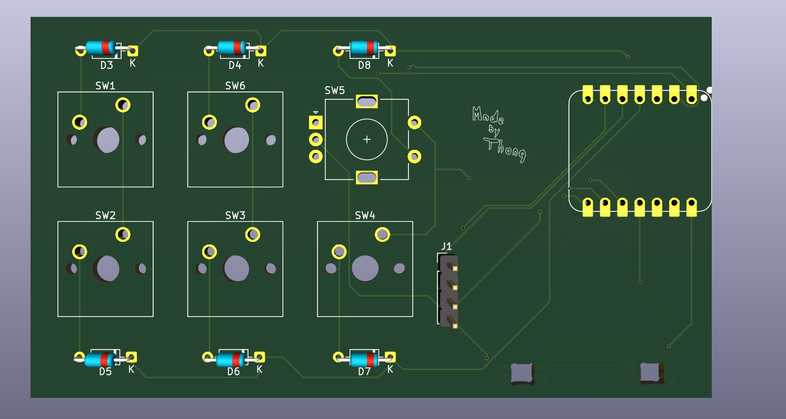
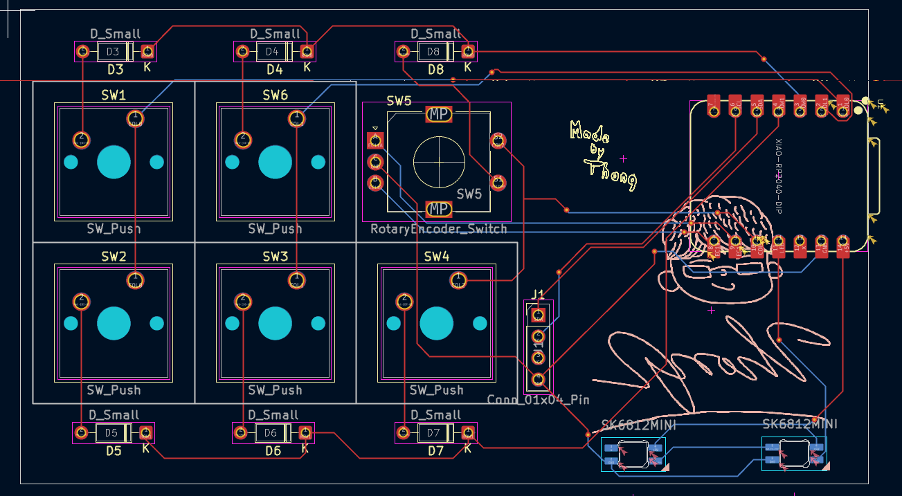

# Hackpad101
I have went back and update this hackpad with these changes:
- Change to button matrix to enable more buttons 
- Include a rotary encoder
- Include 4 pins for an 0.91' OLED screen
Because of that, the case is also updated.
Here is the schematic:

Here is the PCB: 

Here is the case: 

BOM:
- XIAO RP2040 DIP
- 2 RGB SK6812 MINI
- 5 Cherry MX switches
- 5 Blank DSA Keycaps
- 3-D printed case (2 parts)
- 1 EC11 rotary encoder
- 1 I2C 0.91' OLED

