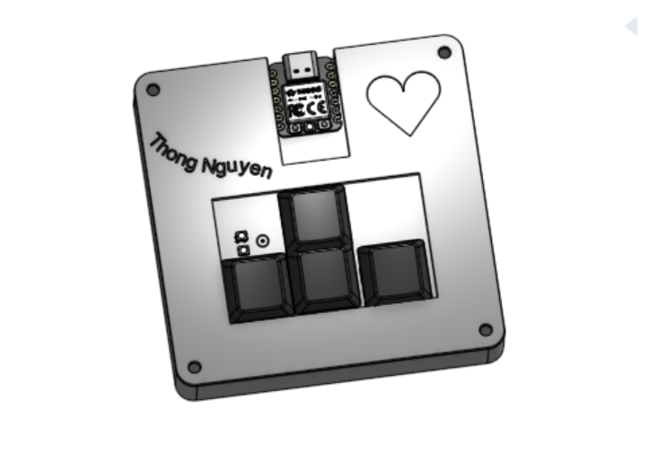
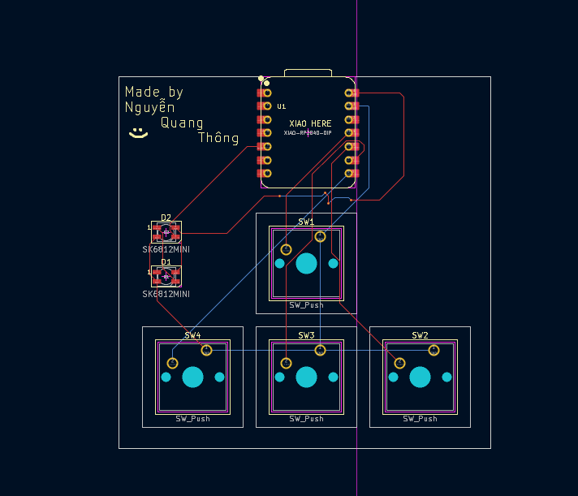
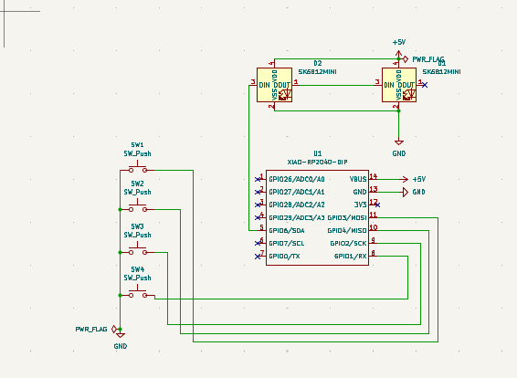
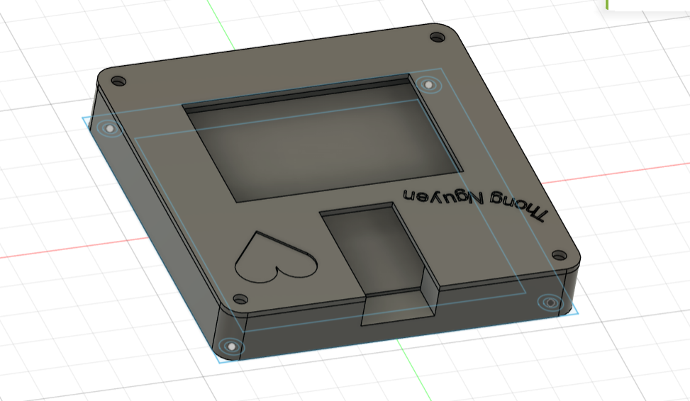

# Hackpad101
My first ever macropad project. In this project, I mainly follow the instructions from HackClub Blueprint and then add some modifications

PCB:

SCHEMATIC:

CASE: 

The bottom and the top part of the case have holes for a screw to go straight through and connect the 2 parts together

BOM:
- XIAO RP2040 DIP
- 2 RGB SK6812 MINI
- 4 Cherry MX switches
- 4 Blank DSA Keycaps
- 3-D printed case (2 parts)

